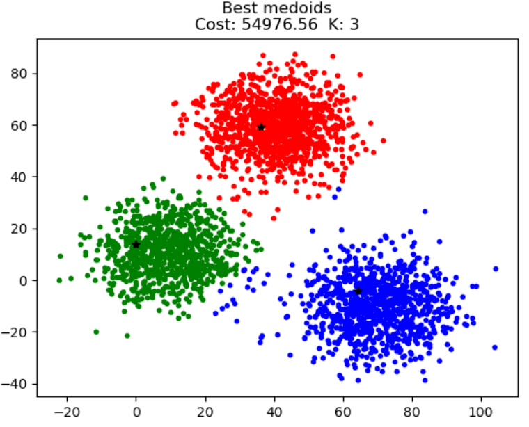
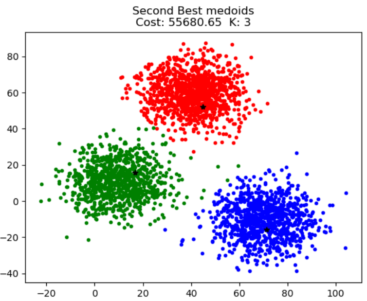

# K-medoids

<!DOCTYPE html>
<html lang="en">
<head>
</head>
<body>
    

        

          <h2>Description</h2>
          
Implementation of the K-medoids algorithm with selection on the second best point as a medoid.
         
          
The K-medoids algorithm or PAM (Partitioning Around Medoids) selects and uses the k-data belonging to the data set as centers of the specified number of clusters, a required parameter for this algorithm is the number of clusters. 

          <h2>Algorithm</h2>
            <ul>
                <li>Select 'k' random points from the dataset as medoids</li>
                <li>Compare the distance between each point on the dataset and the selected medoids</li>
                <li>Calculate the costs for the smallest distances</li>
                <li>Select different medoids</li>
                <li>Compute costs and update medoids if the cost is the second smallest</li>
            </ul>
            

         <h2>Sample results</h2>
         
Using best point as a medoid

            
             
            
Using second best point as a medoid

            
        

      

</body>
</html>
